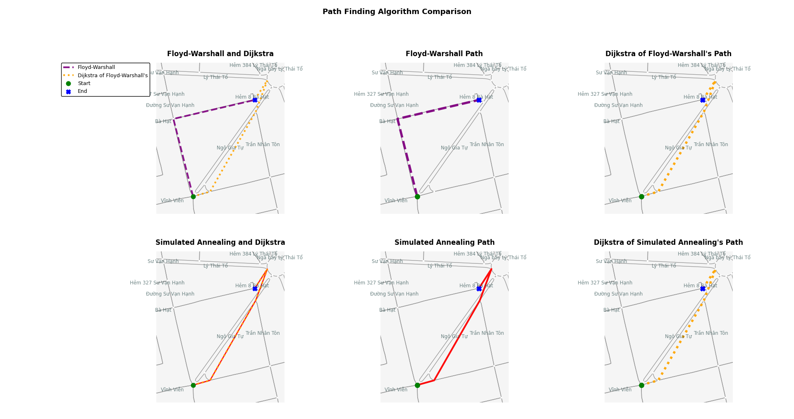

# 🛰️ Floyd–Warshall vs Simulated Annealing for Shortest Path in Dynamic Graphs

A comparative study of the **Floyd–Warshall (FW)** algorithm and **Simulated Annealing (SA)** for solving **shortest path problems** in **traffic-based graphs**.  
Experiments are conducted on both **static** and **dynamic** networks using real-world data from **OpenStreetMap (OSM)**.

> Built with **Python 3.11**

---

## 📘 Overview

The **Floyd–Warshall (FW)** algorithm is a classical dynamic programming approach that computes all-pairs shortest paths in a weighted graph. It performs efficiently on smaller, static graphs but becomes computationally expensive for large or frequently changing networks.

**Simulated Annealing (SA)** is a **metaheuristic optimization technique** inspired by the physical annealing process. It uses **randomized exploration, adaptive temperature control,** and **mutation** to find near-optimal solutions in complex or dynamic environments. While SA is commonly applied to the **Traveling Salesman Problem (TSP)**, this project explores its potential in solving **shortest path problems (SPP)** under **traffic dynamics**.

In this study, **FW** and **SA** are compared based on their performance and adaptability to changing edge weights.  
**Dijkstra’s algorithm** is used as the **ground truth reference** to evaluate the accuracy of both approaches after convergence.

Both FW and SA operate on **directed adjacency matrices** generated from real or synthetic graph data.

---

## 🧩 Testing Scenarios

1. **Graph generation**  
   - Graphs are generated from the **OpenStreetMap API** using `osmnx`.  
   - Nodes represent **road intersections**, and edges represent **roads** connecting them.  
   - Edge weights are computed using three factors:  
     - **Length** of the road  
     - **Maximum allowed speed**  
     - **Number of lanes**

2. **Graph density**  
   - Real-world traffic graphs are typically sparse, with a **density < 0.08**.  
   - To increase diversity, **synthetic random graphs** are generated with predefined densities.

3. **Static graphs**  
   - Edge weights remain constant across iterations.

4. **Dynamic graphs**  
   - Edge weights **change periodically** to simulate fluctuating traffic conditions.  
   - Since FW and SA converge at different speeds, each algorithm experiences different graph states during execution.  
   - After convergence, **Dijkstra’s algorithm** runs on each final graph to determine the **ground-truth shortest path**, which is then used for comparison.

---

## ⚙️ Evaluation Metrics

- **Runtime** – total execution time.  
- **Memory usage** – total RAM consumption.  
- **Error from ground truth** – deviation from Dijkstra’s optimal solution.  
- **Improvement Rate (SA only)** – how much SA improves its initial solution.  
- **Fast Convergence Score (SA only)** – how quickly SA finds a better solution (range: 0–1, lower = faster).

---

## 📂 Repository Structure

| File | Description |
|------|--------------|
| `graph_generator.py` | Generates adjacency matrices using OpenStreetMap data. |
| `map_generator.py` | Visualizes FW and SA paths compared with Dijkstra’s result. |
| `random_dynamic.py` | Compares FW and SA on **dynamic** random graphs. |
| `random_static.py` | Compares FW and SA on **static** random graphs. |
| `real_dynamic.py` | Compares FW and SA on **dynamic** real-world traffic graphs. |
| `real_static.py` | Compares FW and SA on **static** real-world traffic graphs. |

---

## 📄 Reference

This repository contains the source code for the paper:  
📘 [**“Floyd–Warshall vs. Simulated Annealing in Finding Shortest Path in Dynamic Graphs”**](https://ieeexplore.ieee.org/abstract/document/11121623)
